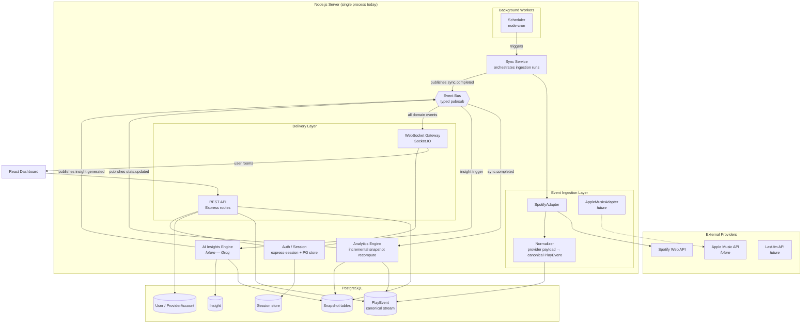
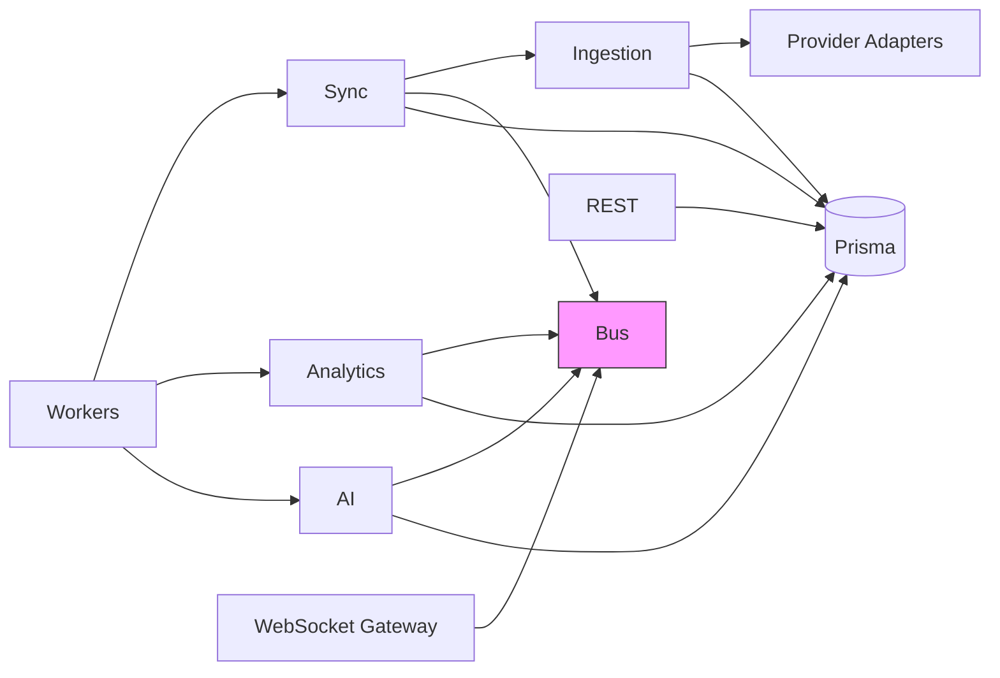
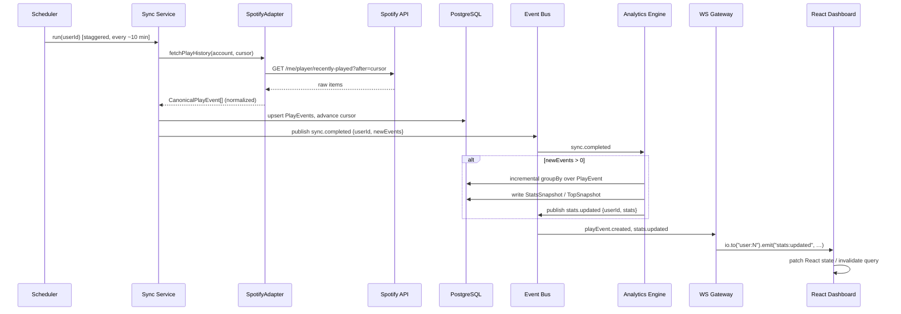
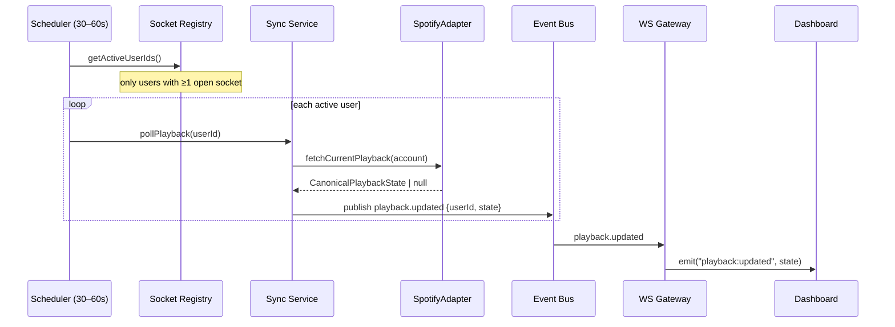
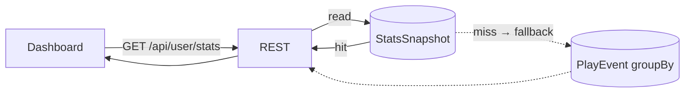
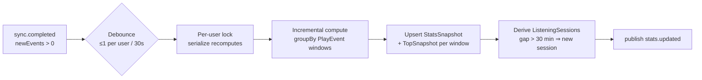
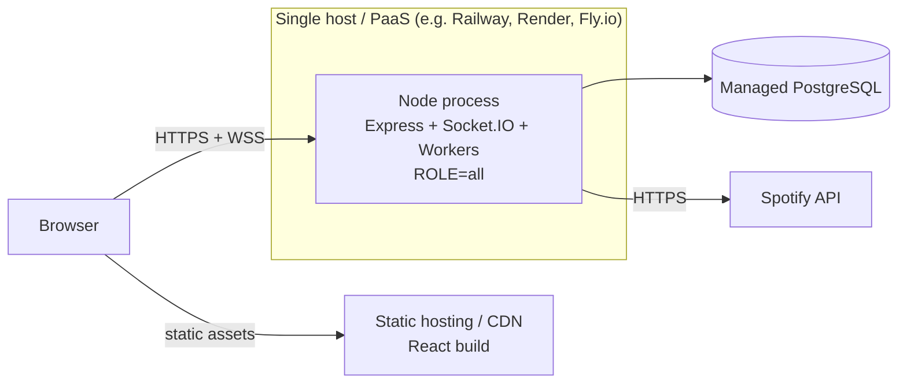
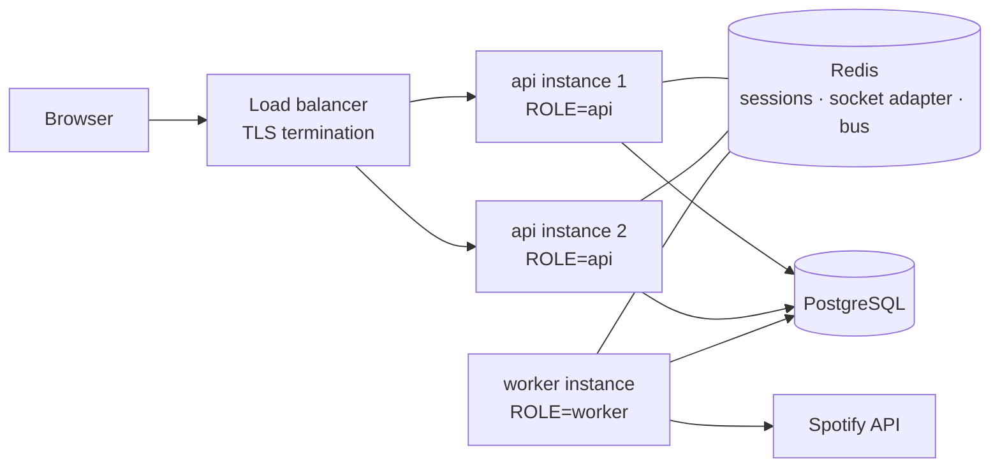

# ARCHITECTURE.md — Spotify Intelligence Platform

> **Status:** Technical blueprint (v1.0, 2026-07-17)
> **Purpose:** The permanent reference for all implementation milestones. Every future PR should be traceable to a section of this document. Changes to architecture happen *here first*, then in code.

---

## Table of Contents

1. [High-Level System Overview](#1-high-level-system-overview)
2. [Architecture Diagrams](#2-architecture-diagrams)
3. [Data Flow](#3-data-flow)
4. [Module Responsibilities](#4-module-responsibilities)
5. [Recommended Folder Structure](#5-recommended-folder-structure)
6. [Database Responsibilities](#6-database-responsibilities)
7. [WebSocket Event Design](#7-websocket-event-design)
8. [Background Worker Design](#8-background-worker-design)
9. [Analytics Pipeline](#9-analytics-pipeline)
10. [Scalability Strategy](#10-scalability-strategy)
11. [Deployment Architecture](#11-deployment-architecture)
12. [Future Extension Points](#12-future-extension-points)
13. [Architectural Rules (Non-Negotiables)](#13-architectural-rules-non-negotiables)
14. [Implementation Roadmap](#14-implementation-roadmap)

---

## 1. High-Level System Overview

### 1.1 What this system is

A **music listening intelligence platform**. It continuously ingests listening activity from music providers (Spotify today; Apple Music, YouTube Music, Last.fm later), stores it as a canonical event stream, derives analytics from that stream, and delivers both historical and real-time views to a React dashboard — with AI-generated insights layered on top.

### 1.2 Core design principles

| Principle | Meaning in practice |
|---|---|
| **Single source of truth** | The `PlayEvent` table is the canonical event stream. Everything else (snapshots, stats, insights) is *derived* and can be rebuilt from it. |
| **Single responsibility per service** | Each module does one thing. Ingestion ingests. Analytics computes. The gateway pushes. No module reaches across layers. |
| **Loose coupling via events** | Services communicate through a typed Event Bus, never by importing each other. The bus is in-process today, Redis pub/sub tomorrow — subscribers don't know the difference. |
| **Reads are precomputed** | HTTP request handlers never aggregate raw events. They read snapshot tables. Computation happens in background workers, off the request path. |
| **Provider-agnostic core** | Only the Ingestion Layer knows Spotify exists. Everything downstream operates on canonical, normalized events. Adding a provider = adding one adapter. |
| **Enhancement, not replacement** | The WebSocket layer *enhances* the REST-loaded dashboard. If sockets fail, the app degrades to today's request/response behavior — never breaks. |
| **Additive evolution** | Migrations add models/nullable fields. Existing routes keep working (with fallbacks) until their replacement is proven. |

### 1.3 The seven layers

```
┌───────────────────────────────────────────────────────────┐
│  React Dashboard (client)                                 │
├───────────────────────────────────────────────────────────┤
│  REST API          │  WebSocket Gateway                   │  ← delivery
├───────────────────────────────────────────────────────────┤
│  Analytics Engine  │  AI Insights Engine (future)         │  ← derivation
├───────────────────────────────────────────────────────────┤
│  Sync Service (orchestration)                             │  ← coordination
├───────────────────────────────────────────────────────────┤
│  Event Ingestion Layer (provider adapters + normalizer)   │  ← acquisition
├───────────────────────────────────────────────────────────┤
│  Background Workers (schedulers driving all of the above) │  ← time
├───────────────────────────────────────────────────────────┤
│  PostgreSQL (events, snapshots, insights, sessions)       │  ← truth
└───────────────────────────────────────────────────────────┘
```

---

## 2. Architecture Diagrams

### 2.1 System component diagram



### 2.2 Dependency direction (who may import whom)



**Rules:**
- The **Event Bus** has no dependencies and everything may depend on it.
- **No service imports another service.** Sync does not import Analytics. Analytics does not import the Gateway. All cross-service communication is a bus event.
- The **WebSocket Gateway only subscribes** — it never queries the database and never calls a service. It maps bus events to socket emissions, nothing more.
- **Provider adapters are only imported by the Ingestion Layer.** If any file outside `ingestion/` imports a Spotify-specific module, that is an architecture violation.

---

## 3. Data Flow

### 3.1 Primary pipeline (the spine of the system)

```
Spotify API → Event Ingestion → Database → Analytics Engine → Snapshot Tables → WebSocket Gateway → React Dashboard
```



### 3.2 Real-time "now playing" flow (fast path)

The fast path **bypasses the Analytics Engine** — playback state is ephemeral, never stored, and only polled for users with an open socket:



**Zero connected users → zero Spotify calls.** This is the rate-limit guarantee.

### 3.3 Read path (REST — unchanged model, precomputed data)



The fallback (compute-on-read when no snapshot exists) stays permanently. It makes snapshot tables *rebuildable caches*, not critical state.

---

## 4. Module Responsibilities

Each module has **exactly one responsibility**, one reason to change, and a defined contract.

### 4.1 Event Ingestion Layer (`src/ingestion/`)

**Responsibility:** Convert provider-specific data into canonical, normalized domain records.

- Defines the **`MusicProviderAdapter` interface** — the seam for multi-provider support:

  ```
  interface MusicProviderAdapter {
    readonly provider: ProviderKind;            // "spotify" | "apple_music" | …
    fetchPlayHistory(account, cursor?): Promise<{ events: CanonicalPlayEvent[]; nextCursor: string | null }>
    fetchCurrentPlayback(account): Promise<CanonicalPlaybackState | null>
    fetchTopItems(account, kind, range): Promise<CanonicalTopItem[]>
    refreshCredentials(account): Promise<ProviderCredentials>
  }
  ```
- `SpotifyAdapter` implements it (wraps today's `spotifyService.ts` logic: token refresh, `spotifyGet`, 429/Retry-After handling).
- The **Normalizer** maps raw payloads → `CanonicalPlayEvent` (provider, providerTrackId, name, artist, album, image, playedAt, durationMs).
- **Owns nothing about scheduling, persistence decisions, or analytics.** It fetches and translates.

**Reason to change:** a provider changes its API, or a new provider is added.

### 4.2 Sync Service (`src/sync/`)

**Responsibility:** Orchestrate ingestion runs and persist canonical events.

- For a given user+provider account: pick the right adapter, pass the stored cursor, upsert returned events (idempotent on `userId + provider + playedAt`), advance the cursor, update sync bookkeeping (`lastSyncedAt`, failure counts, backoff state).
- Publishes `sync.started` / `sync.completed {userId, newEvents}` / `sync.failed` and `playEvent.created` to the bus.
- Handles per-user error policy: after N consecutive auth failures, set `syncEnabled=false` and stop polling that account (publish `sync.disabled`).
- **Does not** know about cron (workers call it), sockets, or analytics.

**Reason to change:** sync policy changes (cursoring, retry, dedup rules).

### 4.3 Analytics Engine (`src/analytics/`)

**Responsibility:** Derive aggregate views from the canonical event stream and persist them as snapshots.

- Subscribes to `sync.completed`; when `newEvents > 0`, recomputes that user's aggregates and writes `StatsSnapshot` + `TopSnapshot` rows.
- Per-user **debounce** (≤1 recompute per 30s) and **serialization** (never two concurrent recomputes for one user).
- Derives `ListeningSession` rows (gap > 30 min ⇒ new session).
- Publishes `stats.updated` after each recompute.
- Exposes pure computation functions (input: userId + window; output: aggregate rows) so REST fallback and backfills reuse identical logic.
- **Does not** serve HTTP, emit sockets, or call providers.

**Reason to change:** a new metric or aggregation window is added.

### 4.4 WebSocket Gateway (`src/gateway/`)

**Responsibility:** Deliver domain events to connected clients, authenticated and scoped per user.

- Attaches Socket.IO to the shared `http.Server`.
- **Auth:** reuses the Express session middleware on the handshake; rejects sockets with no `session.userId`. One auth system, no parallel JWTs.
- Joins each socket to room `user:<userId>`; maintains the **Socket Registry** (active userId → connection count) consumed by the playback poller.
- Subscribes to the bus; translates domain events → socket emissions (`emitters.ts` is a pure mapping table).
- Accepts a minimal set of client→server messages (`sync:request`) which it forwards *as bus events* — it never calls services directly.
- **Does not** query the database or compute anything.

**Reason to change:** delivery concerns (rooms, transport, socket protocol versioning).

### 4.5 REST API (`src/routes/`)

**Responsibility:** Request/response reads and auth flows. (Today's code, slimmed.)

- OAuth flows (`/auth/*`) — delegates token exchange to the provider adapter over time.
- Read endpoints serve **snapshots first, compute-fallback second**. The `groupBy` logic currently inline in `routes/analytics.ts` moves into the Analytics Engine's pure functions and is *called* by the fallback path.
- **Does not** trigger long-running work inline; `GET /user/sync` publishes a `sync.requested` bus event and returns immediately (as it effectively does today with `void triggerSync`).

**Reason to change:** API surface changes.

### 4.6 Background Workers (`src/workers/`)

**Responsibility:** Own *time*. All scheduling lives here and nowhere else.

- `scheduler.ts` boots/stops all cron jobs (called from `server.ts` startup/shutdown).
- Jobs: history polling (~10 min, staggered per user), playback polling (30–60 s, active users only), analytics catch-up sweep (hourly safety net), insight generation (daily).
- Jobs are thin: fetch the target user list, call a service, catch/log. **No business logic in job files.**

**Reason to change:** cadence or job inventory changes.

### 4.7 AI Insights Engine (`src/insights/` — future)

**Responsibility:** Generate narrative/semantic insights from *snapshots* (never raw events).

- Triggered on a slow cadence (daily cron) or on-demand (`insight.requested` bus event).
- Reads snapshot tables → builds a compact prompt → calls Groq (`groq-sdk` already a dependency) → validates/stores result in `Insight` → publishes `insight.generated`.
- Cost control: reads bounded snapshot data, caches per period, per-user rate limits.
- **Does not** block any request path; failures degrade to "no new insight."

**Reason to change:** insight types, prompting strategy, or model provider changes.

### 4.8 Event Bus (`src/events/`)

**Responsibility:** Typed publish/subscribe contract between all services.

- `types.ts` — the single source of truth for every domain event payload.
- `bus.ts` — the transport. **v1:** in-process `EventEmitter`. **v2 (multi-instance):** Redis pub/sub behind the identical interface. Subscribers never change.
- Domain events (internal, dot-notation — distinct from socket events, colon-notation):

  | Event | Payload | Publishers | Subscribers |
  |---|---|---|---|
  | `sync.requested` | `{userId, reason}` | REST, Gateway | Workers/Sync |
  | `sync.started` | `{userId}` | Sync | Gateway |
  | `sync.completed` | `{userId, newEvents}` | Sync | Analytics, Gateway |
  | `sync.failed` | `{userId, error}` | Sync | Gateway |
  | `playEvent.created` | `{userId, event}` | Sync | Gateway |
  | `playback.updated` | `{userId, state}` | Sync | Gateway |
  | `stats.updated` | `{userId, stats}` | Analytics | Gateway |
  | `insight.requested` | `{userId, kind}` | REST, Workers | Insights |
  | `insight.generated` | `{userId, insight}` | Insights | Gateway |

---

## 5. Recommended Folder Structure

```
spotify-analytics/
├── ARCHITECTURE.md                  ← this document
├── client/
│   └── src/
│       ├── components/
│       │   ├── NowPlayingCard.tsx   NEW (M5)
│       │   └── LiveIndicator.tsx    NEW (M4)
│       ├── hooks/
│       │   ├── useAuth.ts           existing
│       │   ├── useSocket.ts         NEW — connection lifecycle
│       │   └── useLiveEvents.ts     NEW — typed event subscription
│       ├── pages/                   existing
│       ├── services/
│       │   ├── api.ts               existing (REST)
│       │   └── socket.ts            NEW — socket.io-client singleton
│       └── types/
│           ├── index.ts             existing
│           └── socketEvents.ts      NEW — mirrors server socket contract
└── server/
    ├── prisma/
    │   └── schema.prisma
    └── src/
        ├── server.ts                http.Server bootstrap: app + gateway + workers
        ├── app.ts                   Express wiring only
        ├── config/
        │   ├── prisma.ts            existing
        │   ├── session.ts           NEW — shared session middleware (Express + Gateway)
        │   └── env.ts               NEW — centralized env validation (lift from server.ts)
        ├── events/
        │   ├── bus.ts               typed pub/sub (EventEmitter now, Redis later)
        │   └── types.ts             all domain event payloads
        ├── ingestion/
        │   ├── types.ts             CanonicalPlayEvent, MusicProviderAdapter, …
        │   ├── registry.ts          provider → adapter lookup
        │   └── providers/
        │       ├── spotify/
        │       │   ├── adapter.ts   implements MusicProviderAdapter
        │       │   ├── client.ts    HTTP + token refresh + rate-limit handling
        │       │   └── normalize.ts raw payload → canonical types
        │       └── (apple-music/, lastfm/ … future)
        ├── sync/
        │   ├── syncService.ts       orchestration + persistence + bus publishing
        │   └── syncPolicy.ts        backoff, failure thresholds, cursor rules
        ├── analytics/
        │   ├── engine.ts            bus subscriber, debounce, serialization
        │   ├── computations.ts      pure aggregate functions (reused by REST fallback)
        │   └── sessions.ts          ListeningSession derivation
        ├── insights/                future (M7)
        │   ├── engine.ts
        │   └── prompts.ts
        ├── gateway/
        │   ├── index.ts             attach io, handshake auth
        │   ├── registry.ts          active-user tracking
        │   ├── emitters.ts          bus event → socket emission mapping
        │   └── events.ts            socket event names + payload types
        ├── workers/
        │   ├── scheduler.ts         cron bootstrap / teardown
        │   └── jobs/
        │       ├── pollHistory.ts
        │       ├── pollPlayback.ts
        │       ├── analyticsSweep.ts
        │       └── generateInsights.ts  future
        ├── routes/                  existing REST (slimmed over time)
        ├── middleware/              existing
        ├── services/                LEGACY — contents migrate into ingestion/ + sync/;
        │                            folder is removed when empty (M2/M3)
        └── types/                   existing shared types
```

**Migration note:** `services/spotifyService.ts` → `ingestion/providers/spotify/`; `services/syncService.ts` → `sync/`. Old import paths keep working via re-exports until each milestone completes, then are deleted.

---

## 6. Database Responsibilities

### 6.1 Table taxonomy

| Category | Tables | Rebuild-able? | Written by |
|---|---|---|---|
| **Identity** | `User`, `ProviderAccount` | No — primary state | Auth routes, Sync (bookkeeping) |
| **Canonical events** | `PlayEvent` | No — source of truth | Sync Service only |
| **Derived** | `StatsSnapshot`, `TopSnapshot`, `ListeningSession` | **Yes** — from `PlayEvent` | Analytics Engine only |
| **Generated** | `Insight` | Yes (at token cost) | Insights Engine only |
| **Infrastructure** | `Session` (connect-pg-simple) | Yes | Session store |

**One-writer rule:** every table has exactly one writing module. Anyone may read.

### 6.2 Target schema (evolution of current models)

```prisma
model User {
  id           Int       @id @default(autoincrement())
  displayName  String?
  email        String?   @unique
  imageUrl     String?
  createdAt    DateTime  @default(now())

  accounts     ProviderAccount[]
  playEvents   PlayEvent[]
  topSnapshots TopSnapshot[]
  statsSnapshot StatsSnapshot?
  sessions     ListeningSession[]
  insights     Insight[]
}

// NEW — extracted from User. The key to multi-provider support:
// a user may link several providers; credentials/cursors are per-account.
model ProviderAccount {
  id               Int       @id @default(autoincrement())
  userId           Int
  provider         String    // "spotify" | "apple_music" | "lastfm" | …
  providerUserId   String    // e.g. spotifyId
  accessToken      String?
  refreshToken     String?
  tokenExpiresAt   DateTime?
  scopes           String?
  historyCursor    String?   // provider-native cursor (Spotify `after` ms timestamp)
  lastSyncedAt     DateTime?
  syncEnabled      Boolean   @default(true)
  syncFailCount    Int       @default(0)
  lastSyncError    String?

  user User @relation(fields: [userId], references: [id], onDelete: Cascade)
  @@unique([provider, providerUserId])
  @@index([syncEnabled, lastSyncedAt])   // poller work-queue query
}

model PlayEvent {
  id         Int      @id @default(autoincrement())
  userId     Int
  provider   String   @default("spotify")   // additive; canonical events carry origin
  trackId    String   // provider-native id, namespaced by `provider`
  trackName  String
  artistId   String
  artistName String
  albumId    String
  albumName  String
  albumImage String?
  playedAt   DateTime
  durationMs Int?

  user User @relation(fields: [userId], references: [id], onDelete: Cascade)
  @@unique([userId, provider, playedAt])
  @@index([userId, playedAt])
}

// NEW — precomputed /stats
model StatsSnapshot {
  userId        Int      @id
  totalPlays    Int
  totalMinutes  Float
  uniqueTracks  Int
  uniqueArtists Int
  computedAt    DateTime
  user User @relation(fields: [userId], references: [id], onDelete: Cascade)
}

// EXISTING — shape already correct; gains a writer (Analytics Engine)
model TopSnapshot {
  id        Int      @id @default(autoincrement())
  userId    Int
  type      String   // "tracks" | "artists" | "albums"
  timeRange String   // "3d" | "28d" | "180d" | "all"
  data      Json
  updatedAt DateTime @default(now())
  user User @relation(fields: [userId], references: [id], onDelete: Cascade)
  @@unique([userId, type, timeRange])
}

// NEW — derived listening sessions (M6)
model ListeningSession {
  id         Int       @id @default(autoincrement())
  userId     Int
  startedAt  DateTime
  endedAt    DateTime?
  trackCount Int
  totalMs    Int
  user User @relation(fields: [userId], references: [id], onDelete: Cascade)
  @@index([userId, startedAt])
}

// FUTURE (M7)
model Insight {
  id          Int      @id @default(autoincrement())
  userId      Int
  kind        String   // "weekly_recap" | "trend" | "discovery" | …
  content     Json
  model       String
  periodStart DateTime
  periodEnd   DateTime
  generatedAt DateTime @default(now())
  user User @relation(fields: [userId], references: [id], onDelete: Cascade)
  @@index([userId, generatedAt])
}
```

### 6.3 Migration strategy

1. All changes are **additive** (new tables, defaulted/nullable columns). No destructive migration until a milestone's replacement path is verified.
2. `ProviderAccount` is introduced with a **data migration** copying token fields from `User`; `User` token columns are dropped only one milestone later, after all reads/writes go through `ProviderAccount`.
3. `PlayEvent.provider` defaults to `"spotify"` so existing rows remain valid; the unique constraint migrates from `[userId, playedAt]` to `[userId, provider, playedAt]`.
4. Snapshot tables can always be truncated and rebuilt — a `rebuildSnapshots(userId)` maintenance path in the Analytics Engine is a first-class requirement.

---

## 7. WebSocket Event Design

### 7.1 Technology and topology

- **Socket.IO 4** attached to the shared `http.Server` (same port as Express). Chosen for built-in reconnection, rooms, auth middleware, long-polling fallback, and a drop-in Redis adapter for horizontal scaling.
- One room per user: `user:<userId>`. All emissions are room-scoped — never broadcast globally.
- Client: `socket.io-client` singleton, `autoConnect: false`, connected only after auth confirms; disconnected on logout. Dev: Vite proxy gains `'/socket.io': { target, ws: true }`.

### 7.2 Authentication

- The Express **session middleware is shared** with the handshake (`io.engine.use(sessionMiddleware)`).
- Handshake guard rejects connections without `session.userId` — the socket mirror of `requireAuth`.
- **Prerequisite:** persistent session store (`connect-pg-simple`) replacing MemoryStore, so sessions survive restarts and are shareable across future instances. No second credential system (no socket JWTs).

### 7.3 Event catalog (socket contract)

Naming: `domain:event`, camelCase payloads, past tense for facts. Server socket events are the *external projection* of internal bus events — the Gateway owns the mapping.

**Server → Client**

| Event | Payload | Purpose |
|---|---|---|
| `sync:started` | `{}` | Show sync spinner |
| `sync:completed` | `{ newEvents: number }` | Refresh recent list if `newEvents > 0` |
| `sync:failed` | `{ message: string }` | Toast/error state |
| `playEvent:created` | `{ event: RecentTrack }` | Prepend to recently-played |
| `playback:updated` | `{ isPlaying, track, progressMs, fetchedAt }` | Now Playing card |
| `playback:stopped` | `{}` | Hide Now Playing card |
| `stats:updated` | `{ totalPlays, totalMinutes, uniqueTracks, uniqueArtists }` | Live stat tiles |
| `insight:generated` | `{ insight: Insight }` | New AI insight badge |

**Client → Server** (minimal — reads stay on REST)

| Event | Ack | Purpose |
|---|---|---|
| `sync:request` | `{ accepted: boolean }` | Replaces polling `GET /user/sync` (REST route retained as fallback) |

**Contract rules:**
- Payload types live in `gateway/events.ts` (server) and are mirrored in `client/src/types/socketEvents.ts`. A future shared package can unify them; for now the mirror is maintained manually and reviewed together.
- Additive payload changes only. A breaking change requires a new event name (`stats:updated:v2`) — old and new emitted in parallel for one release.
- Sockets are **notification/patch channels**, not query channels. Anything request/response-shaped belongs to REST.

### 7.4 Degradation contract

If the socket never connects (network, proxy, bug): the dashboard shows REST-loaded data exactly as today, the Live indicator shows "offline," and manual sync via REST still works. **No feature may exist that has no REST-loadable representation** (e.g. Now Playing simply hides).

---

## 8. Background Worker Design

### 8.1 Job inventory

| Job | Cadence | Targets | Calls | Guard rails |
|---|---|---|---|---|
| `pollHistory` | ~every 10 min | All `ProviderAccount`s with `syncEnabled`, staggered across the interval by `userId` hash | Sync Service | Per-account backoff; disable after N auth failures |
| `pollPlayback` | 30–60 s | **Only users in the Socket Registry** | Sync Service (playback path) | Skip if previous poll for user still in flight |
| `analyticsSweep` | Hourly | Users with events newer than their snapshot `computedAt` | Analytics Engine | Safety net for missed bus events; idempotent |
| `generateInsights` | Daily (future) | Users with fresh weekly activity | Insights Engine | Per-user token budget; skip on no new data |

### 8.2 Design rules

- **Jobs contain no business logic.** A job = select targets → call service → log outcome. All policy (cursors, retries, thresholds) lives in the called service.
- **Stagger, don't stampede.** History polling spreads users across the window (`hash(userId) % windowSeconds`) to smooth Spotify rate-limit consumption.
- **Idempotency everywhere.** Ingestion upserts on `[userId, provider, playedAt]`; snapshot writes are full-row upserts; a job running twice is harmless.
- **Failure isolation.** One user's failure never aborts the batch — per-user try/catch, error recorded on the `ProviderAccount`.
- **Rate-limit citizenship.** The Spotify client honors `429 Retry-After` globally (shared limiter state per provider), and the poller pauses the batch when the provider signals pressure.
- **Lifecycle.** `scheduler.start()` is called from `server.ts` after the HTTP server binds; `scheduler.stop()` runs in the existing shutdown path before `disconnectPrisma()`.
- **v1 runs in-process** with the API (single instance). The scheduler boots only when `ROLE` env (`api|worker|all`, default `all`) includes `worker` — this flag is the zero-rewrite path to a dedicated worker process later (§10).

---

## 9. Analytics Pipeline

### 9.1 Principle

**Request handlers never aggregate.** All aggregation happens in the Analytics Engine, triggered by events or cron — the request path reads precomputed rows.

### 9.2 Pipeline stages



### 9.3 Computation model

- **v1: full recompute per user, incremental per trigger.** A user's aggregates are recomputed from their `PlayEvent` rows on each debounced trigger. At current scale (≤ tens of thousands of events per user) this is milliseconds of Postgres work — correct and simple beats clever.
- The computation functions are **pure** (`computations.ts`): `(userId, window) → aggregate rows`. The same functions serve three callers: the engine (writes snapshots), the REST fallback (snapshot miss), and `rebuildSnapshots` (maintenance/backfill).
- **v2 (when needed):** windowed incremental updates (only recompute affected windows since last `computedAt`) or Postgres materialized views. The pure-function seam makes this an internal swap.
- **AI insights consume snapshots, never raw events** — bounding prompt size and cost by design.

### 9.4 Consistency model

Snapshots are **eventually consistent** with the event stream (seconds behind, bounded by the debounce). This is explicitly acceptable: the dashboard is an analytics view, not a ledger. The hourly `analyticsSweep` guarantees convergence even if a bus event is lost.

---

## 10. Scalability Strategy

### 10.1 Scaling stages

| Stage | Trigger | Change | Enabled by |
|---|---|---|---|
| **S0 — today** | — | Single process: API + Gateway + Workers | — |
| **S1 — persistent sessions** | First deploy of this blueprint | `connect-pg-simple` session store | Removes restart-logout; shared auth state |
| **S2 — process split** | Worker load interferes with API latency | Run `ROLE=api` and `ROLE=worker` as two processes, same codebase | `ROLE` flag (§8.2); bus events that cross processes move to Redis pub/sub |
| **S3 — horizontal API** | Concurrent users exceed one instance | N api instances behind a load balancer | Redis: session store swap, `@socket.io/redis-adapter`, bus on Redis pub/sub |
| **S4 — queue-backed workers** | Polling population exceeds cron batches | Replace cron batches with a job queue (BullMQ) — one job per account | Jobs already 1-user-scoped and idempotent |
| **S5 — event-stream analytics** | Aggregation cost dominates | Materialized views / TimescaleDB continuous aggregates on `PlayEvent` | One-writer rule + rebuildable snapshots |

### 10.2 What makes each step cheap

- **The Event Bus interface** is transport-agnostic — S2/S3 swap `EventEmitter` for Redis pub/sub in `bus.ts` only.
- **Room-per-user + Redis adapter** means socket delivery scales without emitter changes.
- **One-writer tables** mean no cross-instance write contention to untangle.
- **Idempotent, single-user-scoped jobs** map 1:1 onto queue tasks.
- **Sticky sessions are not required** for Socket.IO if long-polling fallback is disabled at S3 (WebSocket-only transport), or the LB uses cookie affinity — decide at S3, not before.

### 10.3 Explicit non-goals (for now)

Microservices, Kafka, a separate WS service, GraphQL, and multi-region are all **deliberately out of scope**. Every seam above exists so these remain *possible*; none is justified at current scale.

---

## 11. Deployment Architecture

### 11.1 Current-stage deployment (S0/S1)



- **One Node process** (`ROLE=all`), one managed Postgres. Client served as static build (or via the same host).
- WebSocket and HTTP share one port/domain → one TLS cert, cookie auth works unchanged.
- Env contract (validated at boot in `config/env.ts`): `DATABASE_URL`, `SESSION_SECRET`, `SPOTIFY_CLIENT_ID/SECRET/REDIRECT_URI`, `FRONTEND_URL`, `PORT`, `ROLE`, later `REDIS_URL`, `GROQ_API_KEY`.
- Health: extend existing `/health` with DB check + scheduler heartbeat (`lastTickAt` per job) for platform health probes.

### 11.2 Target-stage deployment (S3)



Same codebase, same Docker image; behavior selected by `ROLE`. Exactly **one** worker instance runs schedulers (until S4's queue makes workers horizontal too).

### 11.3 Operational requirements per milestone

- Structured logging (userId + module tag on every log line) from M2 onward.
- `sync.failed` / job-error counts surfaced on `/health` — the earliest useful "observability" without new infrastructure.
- Never log tokens; `ProviderAccount` token columns are the only place credentials live (encrypt-at-rest via provider/platform features; app-level encryption is an S3+ consideration).

---

## 12. Future Extension Points

### 12.1 Additional music providers (Apple Music, YouTube Music, Last.fm)

The **only** work required per provider:

1. Implement `MusicProviderAdapter` in `ingestion/providers/<name>/` (client + normalize + adapter).
2. Register it in `ingestion/registry.ts`.
3. Add the provider's OAuth flow to `routes/auth` (creating a `ProviderAccount` row).
4. Add provider branding on the client (link-account button, source badges).

Everything else — sync orchestration, cursors, analytics, snapshots, sockets, insights — already operates on canonical events keyed by `provider` and requires **zero changes**. Providers with different data models (e.g. Last.fm scrobbles have no durations; Apple Music has no "recently played `after` cursor") are absorbed entirely inside their adapter/normalizer.

Cross-provider dedup (same song played once, reported by two providers) is a future Analytics Engine concern — canonical events keep provider-native IDs, so a track-matching layer (ISRC/metadata matching) can be added as a derivation step without touching stored events.

### 12.2 AI Insights growth path

- **v1 (M7):** daily recap + on-demand insight from snapshots via Groq.
- **v2:** conversational queries ("what did my March look like?") — an insight endpoint that assembles snapshot context per question.
- **v3:** taste embeddings / similarity — would add a vector store; slots in as another *derived* store fed by the Analytics Engine, same one-writer pattern.

### 12.3 Other anticipated extensions

| Extension | Slot |
|---|---|
| Public sharing / friend comparison | New REST surface reading snapshots; new `share` room class in Gateway |
| Notifications (email/push weekly recap) | New bus subscriber (`notifications/`) on `insight.generated` |
| Data export (GDPR / takeout) | Reads `PlayEvent` — canonical stream is already the export |
| Import history (Spotify extended streaming history JSON) | A second ingestion path: file → Normalizer → same upsert; cursor-free |
| Mobile client | Same REST + socket contract; session auth may gain a token mode at that point |

---

## 13. Architectural Rules (Non-Negotiables)

These are the review checklist for every future PR:

1. **No service imports another service.** Cross-service communication goes through the Event Bus.
2. **Only `ingestion/` may contain provider-specific code.** `grep -r "spotify" src/ --exclude-dir=ingestion` (excluding auth routes pre-M-provider and config) should trend toward zero.
3. **Only one module writes each table** (§6.1).
4. **Request handlers never aggregate raw events** (fallback path calls Analytics pure functions — it does not inline queries).
5. **The Gateway never touches the database.**
6. **Jobs contain no business logic.**
7. **Socket events are additive**; breaking payload changes require a new event name.
8. **All schema migrations are additive** until the replacement path has shipped and been verified.
9. **Every real-time feature has a REST-degradable fallback.**
10. **Derived tables must be rebuildable** from `PlayEvent` at any time.

---

## 14. Implementation Roadmap

Each milestone ships independently, leaves the app fully working, and maps to sections above.

| # | Milestone | Scope | Blueprint sections |
|---|---|---|---|
| **M1** | Persistent sessions | `config/session.ts` + `connect-pg-simple`; extract `config/env.ts` | §7.2, §11.1 |
| **M2** | Event Bus + ingestion refactor | `events/`, `ingestion/providers/spotify/`, `sync/` (migrate `services/`), `ProviderAccount` + cursor migration | §4.1–4.2, §4.8, §6 |
| **M3** | Background history polling | `workers/` + `pollHistory`, staggering, failure backoff | §8 |
| **M4** | WebSocket Gateway + client plumbing | `gateway/`, http.Server refactor, client `socket.ts`/hooks, `sync:*` + `playEvent:created` events, Live indicator | §7 |
| **M5** | Now Playing | Playback scope in OAuth (users re-consent), `fetchCurrentPlayback`, `pollPlayback` gated on registry, `NowPlayingCard` | §3.2, §8.1 |
| **M6** | Analytics Engine + snapshots | `analytics/`, `StatsSnapshot`/`ListeningSession` models, snapshot-first REST with fallback, `stats:updated` | §9, §6.2 |
| **M7** | AI Insights Engine | `insights/`, `Insight` model, daily job + on-demand, `insight:generated` + UI | §4.7, §12.2 |
| **M8** | Scale-out (on demand, not preemptive) | `ROLE` split, Redis (sessions/adapter/bus), optional BullMQ | §10 |

**Dependency chain:** M1 → M2 → {M3, M4} → M5; M6 requires M2; M7 requires M6; M8 requires M4+M6.

---

*End of blueprint. Amend this document before amending the architecture.*
